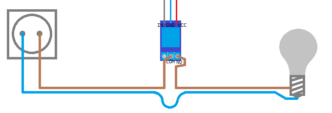

# Standard Light setup

## Hardware

1. Pick an electric wire pair. Cut one of the wires. It should look like the image below:

     
   <small>_Drawn with MSPaint_</small>
2. Pick a relay module and connect the Common (**COM**) pin to the wire end marked **C**.
3. Connect the normally open (**NO**) pin of the relay to the wire end marked **D**.
4. Connect the wire ends marked **E** and **F** to the light.
5. Connect the wire ends marked **A** and **B** to a power source. **A** to Phase and **B** to Neutral.
6. Connect the **GND** pin of the relay module to the **GND** pin/bus of the Arduino board (room controller).
7. Connect the **VCC** pin of the relay module to the **5V** pin/bus of the Arduino board.
8. Connect the **IN** pin of the relay module to one of the GPIO pins of the Arduino board. Remember the pin number for when you want to setup the device in the software.

The end result should look like this:

### Optional: Physical switch

Using a physical switch will allow you to switch the light by either the switch or the app.

Attach a physical switch to the ground on one end and one of the Arduino pins on the other end. The circuit should look like this:

This circuit is independent from the light's circuit. It also does not involve high voltages.

## Software

When creating the device choose 'Light' -> 'Standard'.

There are three fields:

Set the 'Pin' field to the number of the Arduino pin connected to the relay. (See [hardware](#hardware), step 8)

If you have added a [physical switch](#optional-physical-switch), set the 'Physical switch pin' field to the pin number to which the switch is connected. Otherwise, set it to -1 (default).

Now save the device and test it by toggling it in the home page of the Home_modules app.

If the light is inverted (it is on when it is supposed to be off and vice versa), edit the device and enable the 'Invert control pin' checkbox.