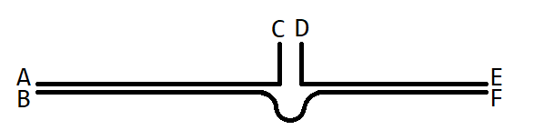
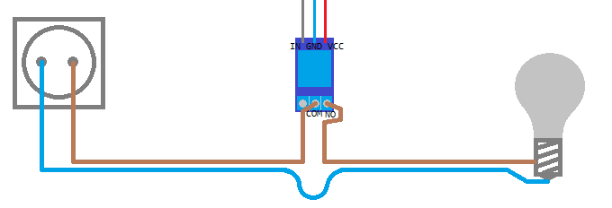

# Setting up your Home_modules-powered smart home

## Required items

- A computer as the hub (preferably a Raspberry PI)
- Compatible room controllers (e.g. Arduino boards)
- Compatible devices
- Appropriate connections for the room controllers and devices (e.g. long USB cables and wires)

## Setting up the hardware

This part will vary depending on the type of the room controllers and devices, but here is a general guide:

1. Install the hub in the appropriate location (e.g. in the living room)
2. Install the room controllers (e.g. Arduino boards) in the appropriate locations in each room
3. Connect the room controllers to the hub.
4. Install the devices and connect then to their room controllers.

Guide for Raspberry PI, Arduino room controllers and simple devices

### The hub

1. Install a Raspberry PI in the living room.

### Room controllers (Arduino)

For each room:

1. Pick an Arduino board (Uno or Nano, or Mega if there are many devices) and install a breakout shield. You can also design your own board.
2. Upload the [`controller-arduino-serial`](github.com/Home-modules/controller-arduino-serial) firmware to the board.

   You can do this step before setting up the hub software, but make sure the current program in the Arduino board doesn't mess up the hardware.
3. Connect a power source to the board.
4. Connect the board to the hub via a long enough USB cable.
5. Install the board somewhere in the room, preferably on the wall.

> **Warning**
> Make sure all connections are solid. Directly solder the connections and avoid ports if you can. Ports are designed for quick connections / disconnections, not permanent connection.

### Devices: Lights

For each light:

1. Take an electric wire pair. Cut one of the wires. The result should be like the image below:

   
2. Take a relay module and connect the Common (COM) pin to the wire end marked C.
3. Connect the normally open (NO) pin of the relay to the wire end marked D.
4. Connect the wire ends marked E and F to the light.
5. Connect the wire ends marked A and B to a power source. A to Phase and B to Neutral.
6. Connect the GND pin of the relay module to the GND pin/bus of the Arduino board (room controller).
7. Connect the VCC pin of the relay module to the 5V pin/bus of the Arduino board.
8. Connect the IN pin of the relay module to one of the GPIO pins of the Arduino board. Remember the pin number for when you want to setup the device in the software.

The end result should look like this:

;

## Setting up the software

### Install and run the hub software

[Running the hub software](running-hub.md)

### Open the web app

If the hub has a graphical operating system and a browser that you can use:

1. Open <http://localhost> (or <https://localhost> if you use HTTPS) on your browser.
2. Install the app if prompted to.

Otherwise:

1. Connect the hub to a local network.
2. Connect your smart phone or computer to the same network
3. Find the local IP address of the hub and enter it in the browser's address bar on your phone or laptop.
4. Install the app if prompted to.

### Login

Enter these default credentials:

- Username: `admin`
- Password: `admin`

After you've logged in, you will be prompted to change your password. Do so.

### Setting up the rooms and devices

For each room:

1. Navigate to Settings -> Rooms.
2. Click the '+' button at the end of the list.
3. Enter a name for the room.
4. Choose a controller type.
5. Fill in the fields.
6. Click 'save' at the bottom.

For each device:

1. Navigate to Settings -> Rooms.
2. Find the room you want to add the device to and click plug icon near it.
3. Click the '+' button at the end of the list.
4. Choose the device type.
5. Enter a name for the device.
6. Fill in the fields.
7. Click 'save' at the bottom.